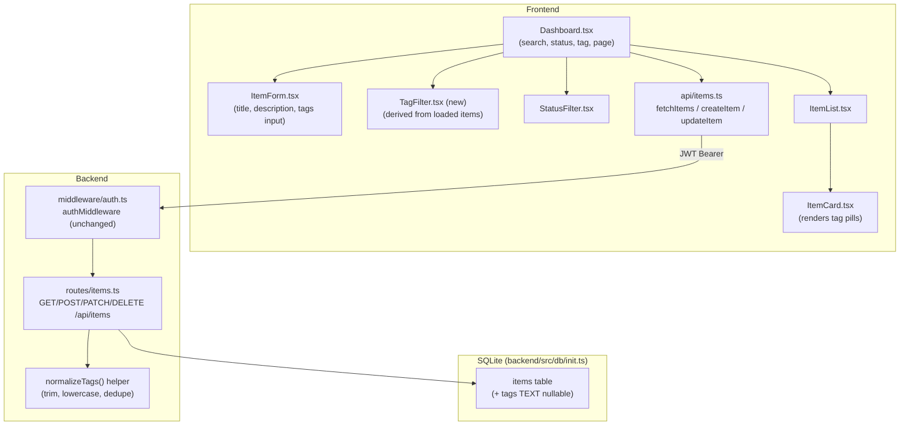
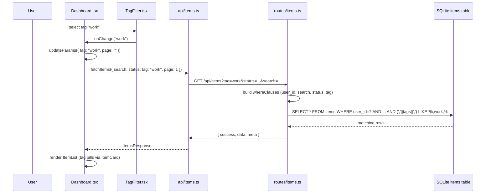

# Architecture — Add Item Tagging and Tag-Based Filtering

## 1. Summary

This change extends the existing **Item Manager** domain (React 18 + TypeScript +
Vite + Tailwind + Zustand frontend; Express + TypeScript + SQLite backend) to
support free-text, comma-separated tags on items and tag-based filtering on the
Dashboard. No new services, tables, or external dependencies are introduced — the
existing `items` table, `/api/items` router, and Dashboard filter pattern
(`search` / `status`) are extended, following the SDLC Stage 2 mandate to "extend,
don't rewrite."

Traceability: all 14 FRs and 17 ACs in [requirements.md](requirements.md) are
covered — see [§8 Traceability Matrix](#8-traceability-matrix).

## 2. Impacted Components

| Layer | File | Change |
|---|---|---|
| DB schema | [backend/src/db/init.ts](backend/src/db/init.ts) | Add nullable `tags TEXT` column + migration guard |
| Backend routes | [backend/src/routes/items.ts](backend/src/routes/items.ts) | `tags` in `createSchema`/`patchSchema`, normalization helper, `tag` query filter |
| Backend middleware | [backend/src/middleware/auth.ts](backend/src/middleware/auth.ts) | **No change** — existing `authMiddleware` already guards all `/api/items` routes |
| Frontend types | [frontend/src/types/index.ts](frontend/src/types/index.ts) | Add `tags: string \| null` to `Item`; add `tag` filter type |
| Frontend API | [frontend/src/api/items.ts](frontend/src/api/items.ts) | `FetchParams.tag`, `createItem`/`updateItem` accept `tags` |
| Frontend components | [frontend/src/components/ItemForm.tsx](frontend/src/components/ItemForm.tsx) | Tags text input |
| Frontend components | [frontend/src/components/ItemCard.tsx](frontend/src/components/ItemCard.tsx) | Render tag pills |
| Frontend components | [frontend/src/components/ItemList.tsx](frontend/src/components/ItemList.tsx) | **No change** — passes `item` through unchanged; tag rendering lives in `ItemCard` |
| Frontend components (new) | `frontend/src/components/TagFilter.tsx` | New control mirroring `StatusFilter.tsx`, options derived from loaded items |
| Frontend pages | [frontend/src/pages/Dashboard.tsx](frontend/src/pages/Dashboard.tsx) | Wire `tag` URL param, render `TagFilter`, pass `tags` through `handleAdd` |

## 3. Component Diagram



## 4. Data Flow



## 5. Database Schema Diff

**File**: [backend/src/db/init.ts](backend/src/db/init.ts)

### Before

```sql
CREATE TABLE IF NOT EXISTS items (
  id          INTEGER PRIMARY KEY AUTOINCREMENT,
  title       TEXT NOT NULL,
  description TEXT,
  status      TEXT DEFAULT 'active',
  user_id     INTEGER REFERENCES users(id),
  created_at  DATETIME DEFAULT CURRENT_TIMESTAMP,
  updated_at  DATETIME
);
```

### After

```sql
CREATE TABLE IF NOT EXISTS items (
  id          INTEGER PRIMARY KEY AUTOINCREMENT,
  title       TEXT NOT NULL,
  description TEXT,
  status      TEXT DEFAULT 'active',
  user_id     INTEGER REFERENCES users(id),
  created_at  DATETIME DEFAULT CURRENT_TIMESTAMP,
  updated_at  DATETIME,
  tags        TEXT      -- nullable, comma-separated, normalized (lowercase, trimmed, deduped)
);
```

### Migration (additive, follows existing `updated_at` guard pattern)

```ts
// Migration: add tags if it was missing from the original schema
const hasTags = cols.rows.some((r: unknown) => (r as { name: string }).name === 'tags')
if (!hasTags) {
  await db.execute("ALTER TABLE items ADD COLUMN tags TEXT")
  console.log('Migration: added tags column to items')
}
```

- Placed immediately after the existing `updated_at` migration block, reusing the
  same `PRAGMA table_info(items)` result (`cols`) already queried — no extra
  round trip.
- Nullable, no default beyond SQLite's implicit `NULL` → existing rows read back
  with `tags: null` (FR-14, AC-17), no backfill required.

## 6. API Contract Changes

**File**: [backend/src/routes/items.ts](backend/src/routes/items.ts)

### 6.1 Validation schema (zod)

```ts
const tagsSchema = z.string()
  .transform(raw => raw.split(',').map(t => t.trim()).filter(t => t.length > 0))
  .refine(tags => tags.length <= 10, { message: 'Maximum of 10 tags allowed' })
  .refine(tags => tags.every(t => t.length <= 30), { message: 'Each tag must be 30 characters or fewer' })
  .optional()

const createSchema = z.object({
  title: z.string().min(1),
  description: z.string().optional(),
  tags: tagsSchema,
})

const patchSchema = z.object({
  title: z.string().min(1).optional(),
  description: z.string().optional(),
  status: z.enum(['active', 'completed', 'archived']).optional(),
  tags: tagsSchema,
})
```

- Field-count and per-tag-length validation runs on the **trimmed, non-empty
  split** of the raw input, *before* case-insensitive dedup (see
  [ADR-002](#adr-002-validate-tag-countlength-before-dedup)). This satisfies FR-04/AC-04/AC-05.

### 6.2 Normalization helper (FR-05)

```ts
function normalizeTags(tags?: string[]): string | null {
  if (!tags || tags.length === 0) return null
  const seen = new Set<string>()
  const result: string[] = []
  for (const raw of tags) {
    const t = raw.toLowerCase()
    if (t && !seen.has(t)) { seen.add(t); result.push(t) }
  }
  return result.length ? result.join(',') : null
}
```

Called from both `POST /` and `PATCH /:id` on `parsed.data.tags` before storage.
Produces the deterministic form asserted by AC-01/AC-03 (`"work,urgent"`).

### 6.3 `POST /api/items`

| | Before | After |
|---|---|---|
| Request body | `{ title, description? }` | `{ title, description?, tags? }` |
| Insert SQL | `INSERT INTO items (title, description, user_id) VALUES (?, ?, ?)` | `INSERT INTO items (title, description, tags, user_id) VALUES (?, ?, ?, ?)` |
| Behavior | — | `tags` normalized via `normalizeTags()`; absent/empty ⇒ `NULL` (FR-02, AC-01, AC-02) |

### 6.4 `PATCH /api/items/:id`

| | Before | After |
|---|---|---|
| Request body | `{ title?, description?, status? }` | `{ title?, description?, status?, tags? }` |
| "Nothing to update" guard | `if (!title && description === undefined && !status)` | `if (!title && description === undefined && !status && parsed.data.tags === undefined)` |
| Set clause | — | `if (parsed.data.tags !== undefined) { setClauses.push('tags = ?'); args.push(normalizeTags(parsed.data.tags)) }` |
| Ownership scoping | `WHERE id = ? AND user_id = ?` | **unchanged** — tags update inherits existing 404-on-foreign-item behavior (FR-03, AC-16) |

### 6.5 `GET /api/items`

| | Before | After |
|---|---|---|
| Query params | `page, limit, search, status` | `page, limit, search, status, tag` |
| Filter build | `whereClauses` / `args` on `user_id`, `search`, `status` | + tag clause, appended in the same `whereClauses`/`args` pattern (AND semantics — FR-06, FR-07) |

```ts
const tag = (req.query.tag as string | undefined)?.trim().toLowerCase() || null
// ...existing search/status clauses...
if (tag) {
  whereClauses.push("(',' || tags || ',') LIKE ?")
  args.push(`%,${tag},%`)
}
```

- Wrapping the stored comma-list in leading/trailing commas before the `LIKE`
  comparison turns a substring match into an exact-segment match: `tags =
  "homework"` becomes `",homework,"`, which does **not** contain `",work,"`
  (AC-07), while `tags = "work,urgent"` becomes `",work,urgent,"`, which does
  contain `",work,"` (AC-06, AC-08). If `tags IS NULL`, the concatenation
  evaluates to `NULL` and the `LIKE` predicate is falsy — no error, no match
  (AC-17). Parameterized via `args`, consistent with existing SQL-injection
  hygiene (Non-Functional: SQL Safety). No extra query round trip is added — the
  clause is folded into the existing `COUNT` + `SELECT` pair (Non-Functional:
  Performance).
- `user_id` remains the first `whereClauses` entry, so tag filtering is always
  scoped to the authenticated user (AC-11), unaffected by this change.

### 6.6 Response shape

Unchanged: `{ success, data, meta }` for `GET`; `{ success, data: { id } }` for
`POST`; `{ success, data: <item> }` for `PATCH`. `data`/`data[]` items now include
`tags: string | null` (rows come straight from `SELECT *`, no serializer change
needed).

## 7. Frontend Changes

### 7.1 Types — [frontend/src/types/index.ts](frontend/src/types/index.ts)

```ts
export interface Item {
  id: number
  title: string
  description: string | null
  status: 'active' | 'completed' | 'archived'
  user_id: number | null
  created_at: string
  updated_at: string | null
  tags: string | null   // NEW — comma-separated, normalized (FR-08)
}
```

### 7.2 API client — [frontend/src/api/items.ts](frontend/src/api/items.ts)

```ts
export interface FetchParams {
  page?: number
  limit?: number
  search?: string
  status?: string
  tag?: string           // NEW (FR-11)
}

export async function createItem(
  title: string,
  description?: string,
  tags?: string,          // NEW
): Promise<{ id: number }> {
  const res = await client.post<{ success: boolean; data: { id: number } }>(
    '/items',
    { title, description, tags },
  )
  return res.data.data
}

export async function updateItem(
  id: number,
  patch: Partial<Pick<Item, 'title' | 'description' | 'status' | 'tags'>>, // + tags
): Promise<Item> {
  const res = await client.patch<{ success: boolean; data: Item }>(`/items/${id}`, patch)
  return res.data.data
}
```

`fetchItems` is unchanged in body (still forwards `params` as-is); adding `tag`
to `FetchParams` is sufficient since axios spreads the object into query params.

### 7.3 `ItemForm.tsx` (FR-09)

- Add a third text input, `data-testid="item-tags-input"`, placeholder `"Tags
  (comma-separated, optional)"`.
- `onAdd` signature widens to
  `(title: string, description: string, tags: string) => Promise<void>`; on
  submit, pass `tags.trim()` alongside existing `title`/`description`, and reset
  the tags field on success (mirrors existing `title`/`desc` reset behavior).
- No client-side hard-fail validation is introduced beyond an
  `input` element — server-side `zod` validation remains authoritative
  (Non-Functional: Validation); AC-04/AC-05 error surfacing reuses the existing
  `catch { setError('Failed to add item.') }` path.

### 7.4 `Dashboard.tsx` (FR-10, FR-13, AC-12–AC-14)

- Read `tag` from `useSearchParams()` alongside `search`/`status`:
  `const tag = searchParams.get('tag') ?? ''`.
- Pass `tag: tag || undefined` into `fetchItems(...)` in `loadItems`.
- Derive tag options from the currently loaded page: `Array.from(new
  Set(items.flatMap(i => (i.tags ?? '').split(',').filter(Boolean)))).sort()` —
  no new endpoint (per Assumptions & Constraints).
- Render `<TagFilter value={tag} options={tagOptions} onChange={v =>
  updateParams({ tag: v, page: '' })} />` in the existing filters row, next to
  `StatusFilter`. Selecting the existing `""`/"All Tags" option removes `tag`
  from the URL via the existing `updateParams` "falsy value deletes key" rule
  (FR-13, AC-13) — **no change needed to `updateParams` itself**.
- `handleAdd` forwards the new tags value: `await createItem(title, description
  || undefined, tags || undefined)`.
- Filter composition and pagination reset already fall out of the existing
  `updateParams`/`loadItems` dependency array (`[page, search, status]` → add
  `tag`) — satisfies AC-14 with no new logic.

### 7.5 `TagFilter.tsx` (new component, FR-10, FR-13)

Mirrors [StatusFilter.tsx](frontend/src/components/StatusFilter.tsx) exactly in
shape (a `<select>`), but options are supplied by the parent instead of a fixed
enum, since tag values are open-ended free text:

```tsx
interface Props {
  value: string
  options: string[]
  onChange: (v: string) => void
}

export default function TagFilter({ value, options, onChange }: Props) {
  return (
    <select
      value={value}
      onChange={e => onChange(e.target.value)}
      className="border rounded-lg px-3 py-2 text-sm focus:outline-none focus:ring-2 focus:ring-blue-400"
      data-testid="tag-filter"
    >
      <option value="">All Tags</option>
      {options.map(t => (
        <option key={t} value={t}>{t}</option>
      ))}
    </select>
  )
}
```

Keyboard-operable, semantic `<select>`/`<option>` — satisfies the Accessibility
non-functional requirement identically to `StatusFilter`.

### 7.6 `ItemCard.tsx` (FR-12, AC-15)

- Below the existing description/date block, render tag pills when
  `item.tags` is truthy:

```tsx
{item.tags && (
  <div className="flex flex-wrap gap-1 mt-1">
    {item.tags.split(',').filter(Boolean).map(t => (
      <span
        key={t}
        className="text-xs px-2 py-0.5 rounded-full bg-purple-100 text-purple-700"
        data-testid={`item-tag-${item.id}-${t}`}
      >
        {t}
      </span>
    ))}
  </div>
)}
```

- Visually distinct from the existing `STATUS_COLORS` badge (separate color
  scheme, `rounded-full` pill) so tags are not confused with status (AC-15).

### 7.7 `ItemList.tsx`

No change — it already passes the full `item` object to `ItemCard`, which owns
tag rendering.

## 8. Traceability Matrix

| FR/AC | Component(s) |
|---|---|
| FR-01, AC-17 | [backend/src/db/init.ts](backend/src/db/init.ts) §5 migration |
| FR-02, AC-01, AC-02 | `POST /api/items` §6.3 |
| FR-03, AC-16 | `PATCH /api/items/:id` §6.4 |
| FR-04, AC-04, AC-05 | `tagsSchema` §6.1 |
| FR-05, AC-01, AC-03, AC-08 | `normalizeTags()` §6.2 |
| FR-06, FR-07, AC-06–AC-11 | `GET /api/items` tag clause §6.5 |
| FR-08 | `types/index.ts` §7.1 |
| FR-09, AC-01, AC-04, AC-05 | `ItemForm.tsx` §7.3 |
| FR-10, AC-12, AC-14 | `Dashboard.tsx` + `TagFilter.tsx` §7.4–7.5 |
| FR-11 | `api/items.ts` §7.2 |
| FR-12, AC-15 | `ItemCard.tsx` §7.6 |
| FR-13, AC-13 | `Dashboard.tsx` `updateParams` reuse §7.4 |
| FR-14, AC-02, AC-17 | `normalizeTags()` + migration, §5–6.2 |

All 14 FRs and 17 ACs are mapped to at least one concrete file/change.

## 9. Architecture Decision Records

### ADR-001: Single comma-separated `TEXT` column vs. join table

**Decision**: Store tags as one `tags TEXT` column on `items`, not a normalized
`tags`/`item_tags` join table.

**Rationale**: Requirements explicitly constrain this to follow existing SQLite
conventions and introduce no new external dependencies/tables; scope excludes a
tag management screen, multi-select filtering, and cross-user tag sharing — all
of which would justify a join table. A join table would also require new
endpoints (`GET /api/tags`) outside this scope.

**Consequence**: Tag filtering relies on string pattern matching
(`,tag,` `LIKE`) rather than an indexed foreign key join; acceptable at current
scale (paginated, per-user item lists) and consistent with existing `search`
`LIKE` usage in the same route. Revisit if multi-select tag filtering or a tags
management UI is added later.

### ADR-002: Validate tag count/length before dedup

**Decision**: The `zod` `refine` checks (`max 10`, `max 30 chars`) run on the
trimmed, non-empty split of the raw input — **before** case-insensitive
deduplication.

**Rationale**: FR-04 says "maximum of 10 tags per item" as an input-validation
rule; validating post-dedup could let a client bypass the effective limit by
sending many near-duplicate casings (e.g. 15 case-variant tags collapsing to 3
unique) that still represent oversized/abusive input. Validating pre-dedup
keeps the check simple, deterministic, and directly traceable to AC-04's literal
"11 comma-separated tags" scenario.

**Consequence**: A user submitting 10 truly-unique tags plus 1 duplicate (11
raw segments) is rejected, even though the deduped result would be ≤10. This is
a conservative, security-favoring interpretation and is called out here since
requirements do not disambiguate pre- vs. post-dedup counting.

### ADR-003: Exact-match tag filter via comma-wrapped `LIKE`, not `LIKE '%tag%'`

**Decision**: Filter with `(',' || tags || ',') LIKE '%,<tag>,%'` instead of a
raw substring `tags LIKE '%<tag>%'`.

**Rationale**: AC-07 explicitly requires that a `"homework"`-tagged item must
not match `tag=work`. A raw substring `LIKE` would produce a false positive.
Wrapping both the column and the parameter in comma delimiters converts the
substring search into a whole-segment match without needing a join table,
`json_each`, or an FTS virtual table (all of which are unnecessary complexity
for this scope, and FTS would be a new dependency).

**Consequence**: Correctness depends on tags never containing a literal comma
inside an individual tag value; this is already guaranteed because commas are
the tag *separator* used throughout normalization/splitting, so no tag value
can itself contain one.

### ADR-004: Tag filter options derived client-side from loaded items, no new endpoint

**Decision**: `TagFilter` options are computed in `Dashboard.tsx` from the tags
present on the currently-loaded page of items, rather than adding a `GET
/api/items/tags` (distinct-tags) endpoint.

**Rationale**: Explicitly scoped this way in requirements' Assumptions &
Constraints ("no new 'list all distinct tags' endpoint is introduced in this
scope") and out-of-scope items (no autocomplete/suggestions).

**Consequence**: The filter dropdown only offers tags visible on the current
page/filter state, not every tag the user has ever created; acceptable given
the stated scope and avoids a new backend query pattern.

## 10. Non-Functional Compliance Summary

| Requirement | How satisfied |
|---|---|
| Authentication | Tag routes ride the existing `router.use(authMiddleware)` — no new routes added |
| Validation | `zod` `tagsSchema` is authoritative server-side; client input has no bypass |
| SQL Safety | Tag clause uses `args` parameter binding, identical pattern to `search`/`status` |
| Performance | Tag clause folded into existing single `COUNT` + `SELECT` pair — no added round trip |
| Backward Compatibility | `tags` column is nullable, additive `ALTER TABLE`, default `NULL` |
| Accessibility | `TagFilter` uses a native `<select>`/`<option>`, keyboard-operable like `StatusFilter` |

## 11. Out of Scope (carried from requirements)

No dedicated tag management screen, no multi-select tag filtering, no tag
autocomplete, no cross-user tag sharing, no case-insensitive search beyond
save-time normalization, no changes to auth, pagination size, or the `status`
enum. This architecture introduces no components or contracts covering these.
